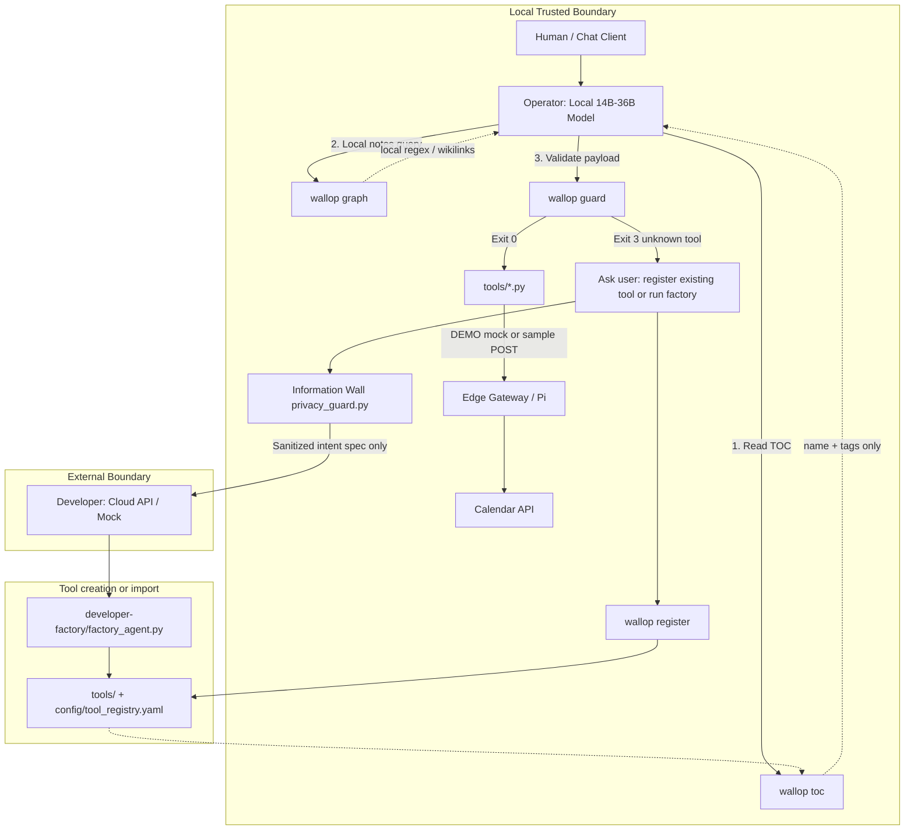

# Wallop

A privacy-first, token-lean toolbox and execution harness for local small LLMs.

Local small models (14B–36B class, ~64k context) struggle with two extremes: stuffing dozens of verbose JSON schemas into the prompt exhausts the window, while asking weak models to author code on the fly triggers hallucinations and retry loops.

**Wallop consolidates tool governance into one managed box.** The local model is the 24/7 **Operator**: it discovers tools from a compressed Table of Contents and can execute registered Python scripts without switching frameworks. When a capability is missing, Wallop can delegate creation to an on-demand **Developer** loop behind a deterministic **Information Wall**, so private notes, calendar titles, and host credentials stay on the machine.

The catalog is not limited to factory-generated tools. Any standalone Pydantic script can live in `tools/` and be indexed in `config/tool_registry.yaml` if the user wants it in the same box. Use `wallop register` after they say yes. The Go CLI and the agent skill are recommendations, not a lock-in. Direct `python tools/<name>.py` imports stay valid.

**Who it is for.** Developers running local models (Ollama, llama.cpp, vLLM, Hermes, Open WebUI) who want cheap daily tool execution, a privacy boundary before any cloud developer call, and one repo that can hold both factory-made and hand-written tools.

**Who it is not for.** Turnkey multi-agent products (CrewAI, Dify, AutoGen), hosted browsing agents, or visual workflow canvases.

### 30-second quickstart

No API key. Ends with `DEMO OK` (Python still succeeds if Go is missing).

```bash
git clone https://github.com/dan88c/wallop.git && cd wallop
python3 scripts/bootstrap.py
```

Windows:

```powershell
git clone https://github.com/dan88c/wallop.git; cd wallop
py -3 scripts\bootstrap.py
```

Then list the catalog (prebuilt binary, no Go toolchain):

```bash
mkdir -p bin && cp dist/wallop-linux-amd64 bin/wallop && chmod +x bin/wallop && ./bin/wallop toc
```

```powershell
New-Item -ItemType Directory -Force bin | Out-Null
Copy-Item dist\wallop-windows-amd64.exe bin\wallop.exe
.\bin\wallop.exe toc
```

macOS Apple Silicon: copy `dist/wallop-darwin-arm64` instead of the linux binary.

Point the operator at the skill or it will not use Wallop on its own. Paste into Hermes / Ollama / Open WebUI system prompt:

```text
Read skills/wallop/SKILL.md on startup and on any unknown tool request.
Run wallop toc before guessing tools. Validate with wallop guard before python tools/<name>.py.
Exit 3 = ask the human before register or factory.
```

## Why Wallop

1. **Context exhaustion.** `wallop toc` is name + tags only. Use `--full` after a guard miss.
2. **No framework lock-in.** Tools stay ordinary Pydantic scripts in one YAML catalog.
3. **Asymmetric intelligence.** Routine calls stay local at $0. Code generation is a single burst through the wall, only when something is missing and the user wants a new file here.

| Role | Operator (local runner) | Developer (tool maker) |
|------|-------------------------|------------------------|
| Host | Windows / Linux / macOS | Cloud API or a second local host |
| Model | Local 14B–36B | Stronger model, or offline mock |
| Runtime | Static `wallop` binary, or direct Python | Python 3.11+ factory |
| Job | TOC, guard, graph, register | Propose Pydantic tools + pytest |
| Cost | $0 for routine calls | One call on a gap |

## Architecture



`tools/calendar_gateway.py` is **demo-only**: a sample pipe for bootstrap and tests, not a production calendar client. Keep `MOCK_MODE=true` unless you are deliberately exercising a local edge webhook. OAuth does not live in this repo.

## Installation

### 1. Clone

```bash
git clone https://github.com/dan88c/wallop.git
cd wallop
```

### 2. Bootstrap and demo

```powershell
py -3 scripts\bootstrap.py
```

```bash
python3 scripts/bootstrap.py
```

Ends with `DEMO OK`. Python still succeeds if Go is missing.

### 3. Operator CLI (no Go required)

Platform binaries live in `dist/` in this repo and on GitHub Releases (`nightly` plus `v*` tags).

```bash
mkdir -p bin
cp dist/wallop-linux-amd64 bin/wallop && chmod +x bin/wallop   # Linux amd64
# cp dist/wallop-darwin-arm64 bin/wallop && chmod +x bin/wallop  # macOS Apple Silicon
./bin/wallop toc
```

Windows PowerShell:

```powershell
New-Item -ItemType Directory -Force bin | Out-Null
Copy-Item dist\wallop-windows-amd64.exe bin\wallop.exe
.\bin\wallop.exe toc
```

### 4. Building from source (Go 1.22+ required)

Use this if you prefer compiling instead of `dist/` or a Release. GNU Make is optional. The Go module lives in `core-operator/`, so the `-C` form below works from the repo root without Make.

**macOS / Linux**

```bash
make build
# Or directly via Go (no Make):
mkdir -p bin
go build -C core-operator -o ../bin/wallop ./cmd/harness
```

**Windows (PowerShell)** — Go installed, Make not required:

```powershell
New-Item -ItemType Directory -Force bin | Out-Null
go build -C core-operator -o ..\bin\wallop.exe .\cmd\harness
```

Then `.\bin\wallop.exe toc` or `./bin/wallop toc`.

### 5. Optional skill symlink

```bash
mkdir -p "$HOME/.agents/skills"
ln -s "$PWD/skills/wallop" "$HOME/.agents/skills/wallop"
```

```powershell
New-Item -ItemType Directory -Force -Path "$HOME\.agents\skills" | Out-Null
New-Item -ItemType SymbolicLink -Path "$HOME\.agents\skills\wallop" -Target "$PWD\skills\wallop"
```

### 6. Instructing your agent

A symlink is not enough. The operator only follows Wallop if the system prompt tells it to load the skill.

Add this to Hermes, Ollama, Open WebUI, or any local agent instructions:

```text
## Tool governance (wallop)

You have the wallop skill at skills/wallop/SKILL.md
(or ~/.agents/skills/wallop after the optional symlink).

On startup and on any unknown tool request:
1. Read skills/wallop/SKILL.md.
2. Run wallop toc. Do not assume tools exist until they appear there.
3. Before python tools/<name>.py, run:
   wallop guard --tool <name> --payload '<json>'
4. Exit 0 = run the script with the same JSON on stdin.
   Exit 1 = fix payload, retry at most twice.
   Exit 3 = stop and ask the human before wallop register or the factory.
```

Shorter variant:

> Read `skills/wallop/SKILL.md` to learn your tool execution rules. Always run `wallop toc` to discover tools before guessing. Validate parameters with `wallop guard` before running any script. If a tool is missing (exit 3), ask the user before touching the factory.

## CLI

```bash
wallop toc
wallop toc --full
wallop guard --tool calendar_gateway --payload '{"action":"list"}'
wallop graph --vault ./sandbox/vault --query home
wallop register --entry ./path/to/script.py --name my_counter --desc "Count words" --tag text --param text:string:required
```

`calendar_gateway` in the example above is the demo tool (tag `demo`).

| Exit | Meaning | Suggested action |
|------|---------|------------------|
| 0 | Payload accepted | Run `tools/<name>.py` |
| 1 | Invalid call | Fix and retry at most twice |
| 2 | Usage | Fix flags |
| 3 | Unknown tool | Ask: `wallop register` or factory |
| 4 | Bad JSON | Reserialize a flat object |

`wallop` walks up from cwd (or uses `WALLOP_ROOT`) to find `config/tool_registry.yaml`.

## Bring your own tools

Ask first, then:

```bash
wallop register --entry ./path/to/script.py --name my_counter --desc "Count words" --tag text --param text:string:required --risk read
```

Copies to `tools/my_counter.py` and upserts the YAML unless `--keep-path` is set. Then `wallop toc` lists the new name.

The factory is only for generating a *new* stub when no ready file exists.

## Developer factory and the wall

**Factory model requirement.** Live synthesis needs code-generation intelligence that can emit Pydantic v2 schemas and pass pytest on the first try. The weak operator model is not that model.

- **Default (`MOCK_MODE=true`):** deterministic offline templates. No API key, no internet, no second LLM. Fine for clone-and-demo.
- **Recommended live path:** a frontier coding model via API (Claude 3.5 Sonnet, GPT-4o, DeepSeek-Coder, or OpenRouter) through `CLOUD_DEVELOPER_URL` and `CLOUD_DEVELOPER_TOKEN`. Only a sanitized abstract from `privacy_guard.py` may leave the machine.
- **Local alternative:** a strong secondary coder (70B+ or a dedicated coding checkpoint). Do not point the factory at the local 14B–36B operator.

```bash
# Offline / demo (default)
python developer-factory/factory_agent.py --name wiki_search --desc "Keyword search over a vault" --tag read --param query:string:required

# Live Developer model — only after URL + token are set
# MOCK_MODE=false
# CLOUD_DEVELOPER_URL=https://your-proposer.example/v1/propose
# CLOUD_DEVELOPER_TOKEN=...
python developer-factory/factory_agent.py --brief "Calculate business days between two ISO dates"
```

## Configuration

| Variable | Default | Role |
|----------|---------|------|
| `MOCK_MODE` | `true` | No sockets |
| `EDGE_CALENDAR_WEBHOOK` | `http://127.0.0.1:8088/webhook/calendar` | Demo edge URL only |
| `VAULT_PATH` | `./sandbox/vault` | `wallop graph` |
| `HARNESS_TZ` | `Asia/Hong_Kong` | Past-date boundary |
| `TIME_OPS_LOG_PATH` | `./data/time_ops.log` | Time-ops log |
| `CLOUD_DEVELOPER_URL` | unset | Live factory proposer |
| `CLOUD_DEVELOPER_TOKEN` | unset | Optional bearer for that URL |
| `WALLOP_ROOT` | inferred | Repo root |

## Layout

```text
.
├── AGENTS.md
├── config/tool_registry.yaml
├── core-operator/
├── developer-factory/
├── dist/                   # committed platform binaries
├── tools/                  # calendar_gateway.py is demo-only
├── skills/wallop/SKILL.md
└── scripts/bootstrap.py
```

## Makefile

```bash
make demo
make build
make test-py
make test-go
make toc
make guard TOOL=calendar_gateway PAYLOAD='{"action":"list"}'
make graph VAULT=./sandbox/vault QUERY=home
make register ENTRY=./script.py NAME=my_counter
make factory ARGS='--name wiki_search --desc "Keyword search over a vault" --tag read --param query:string:required'
```

## Security boundaries

1. `calendar_gateway` is a demo tool. Calendar OAuth does not belong on the operator host. Real writes, if any, stop at an edge webhook outside this repo.
2. Cloud developer calls see only `privacy_guard.py` output.
3. The recommended operator path uses registered names from the YAML. Direct Python remains available so other stacks are not blocked.

## Mascot

```text
       __    __
      /  \\  /  \\        WALLOP (`wallop`)
     | () || () |       typed Go shell and information wall
      \\__/  \\__/        mascot: mantis shrimp
       /______\\
     /|  \\__/  |\\       shell = TOC compression, guard, register
    |_|  /  \\  |_|      punch = less prompt bloat, no vendor lock-in
```
